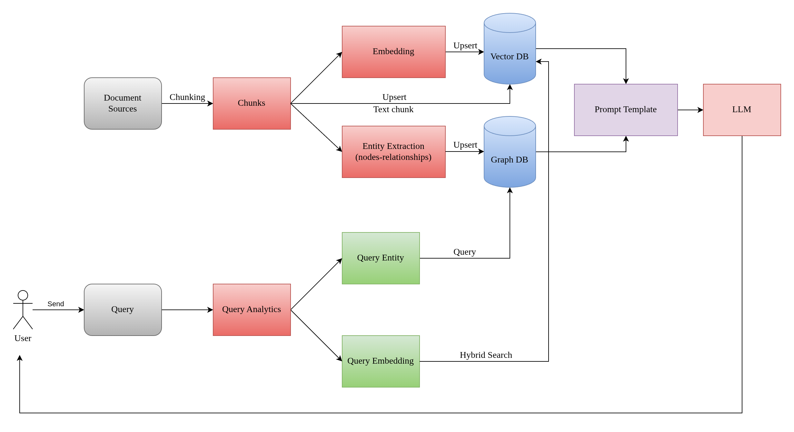

# Hybrid Knowledge Graph RAG System
A Retrieval-Augmented Generation (RAG) system that combines **Knowledge Graph** structured data with Native RAG (Hybrid Semantic Search over document chunks). This approach leverages the precision of graph relationships and the breadth of unstructured text to provide accurate, context-aware responses.

## Overview
HybridRAG solves the limitations of standalone vector search by integrating structured knowledge. The system extracts entities and relationships from text into a Neo4j graph while simultaneously maintaining a Hybrid Search Index (BM25 + Neo4j Dense Vector) for document chunks.

The retrieval pipeline uses a sophisticated strategy:
- **Graph RAG**: Structured entity relationships from Neo4j
- **Native RAG**: Uses Reciprocal Rank Fusion (RRF) to combine keyword search (BM25) and semantic search (Dense Vector).
- **Query Analysis**: LLM-powered entity extraction and query normalization
- **Smart Exclusion**: Handles queries like "Besides X, what else..." by excluding specific entities

## Key Features
### Hybrid Retrieval Architecture
- **Dual-Mode Retrieval**: Combines graph triples and semantic chunks for comprehensive context
- **BM25 + Dense Fusion**: Hybrid search using both lexical and semantic matching with Reciprocal Rank Fusion (RRF)
- **Deduplication**: Prevents duplicate entities, relationships, and chunks across multiple indexing runs

### Query Processing
- **Query Analysis**: Extracts target entities and excluded entities from user queries
- **Query Normalization**: Converts user queries into optimized search terms for better retrieval

### Visualization
- **Interactive Knowledge Graph**: Visualize entities and relationships

## System Workflow


## Installation

### Prerequisites
- Python 3.11+
- Neo4j Database (local or remote)
- OpenAI-compatible API endpoint

### Installation
1. **Create Environment**:
   ```bash
   conda create -n graphrag python=3.11.11
   conda activate graphrag
   ```

2. **Install Dependencies**:
   ```bash
   pip install -r requirements.txt
   ```

3. **Configure Settings**:
    ```bash
    cp .env.example .env
    # Edit .env with your settings
    ```

## Usage

### 1. Indexing (Extract & Store)

Extract entities and relationships from documents, then store in Neo4j:

```bash
python main.py --indexing --query_keyword "Elizabeth I" --load_max_docs 10
```

### 2. Querying (Retrieve & Generate)

Query the knowledge graph with natural language:

```bash
python main.py --querying "Tell me about Elizabeth and her relationships"
```

### 3. Visualization

Visualize the knowledge graph in an interactive HTML file:

```bash
python main.py --visualizing
```

Opens `graph.html` showing entities as nodes and relationships as edges.


## Technical Details

### Deduplication Strategy

**Database Level**:
- `Entity.id` uniqueness constraint
- `Chunk.id` uniqueness constraint
- MERGE operations for idempotent upserts

**Index Level**:
- Deduplicates chunks by ID when building FAISS/BM25 indexes
- Prevents duplicate documents in search results

### Hybrid Search

**BM25 (Lexical)**:
- Token-based matching
- Good for exact keyword matches

**Dense (Semantic)**:
- Sentence embeddings with cosine similarity
- Captures semantic meaning

**RRF Fusion**:
- Combines scores from both methods
- Reciprocal Rank Fusion for balanced results

### Model Configuration

**Embedding Models**:
- Vietnamese: `hiieu/halong_embedding`
- English: `sentence-transformers/all-MiniLM-L6-v2`

**LLM**:
- Model (Self-hosted): `Qwen3-4B`
- Extraction: Structured output with JSON schema
- Response: Context-aware synthesis
